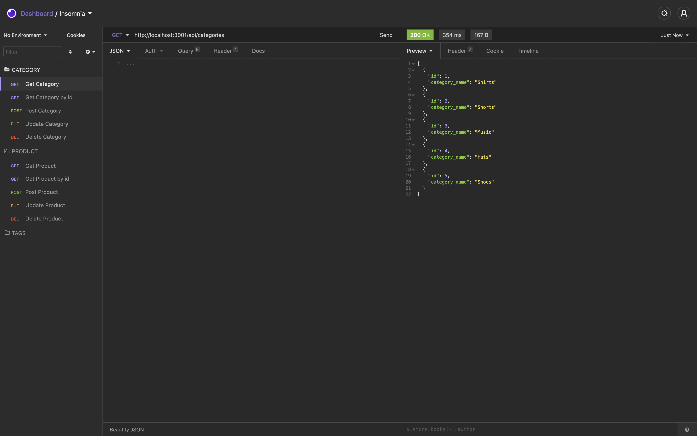
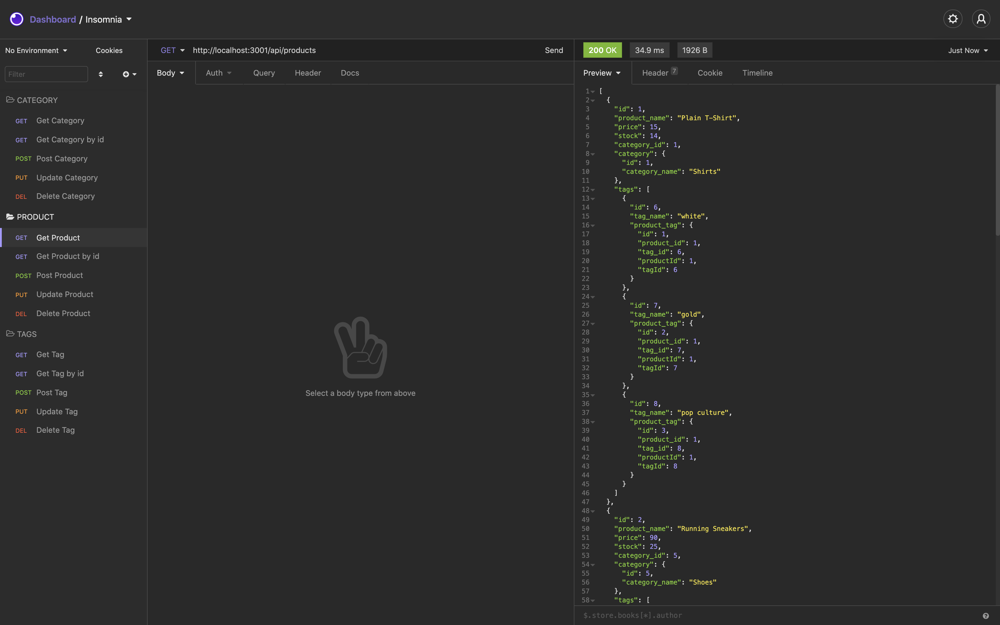

# E-Commerce Back End
  
  
  

  ## Description 
  This app is a back end for an e-commerce site. Working with Express.js API to use Sequelize to interact with a MySQL database.

  
  

  ## Table of Contents
  
  * [Installation](#installation)
  * [Usage](#usage)
  * [License](#license) 
  * [Contributing](#contributing)
  * [Questions](#questions) 
  
  ## Installation
  1. Clone or download the repository
  1. Open console
  1. Run `npm install` to install dependencies
  
  ## Usage
  1. Update the [.env](./.env) file with your username and password
  1. Write `npm run start` or `npm start` in console to start the application

Please refer to this [video](https://drive.google.com/file/d/1yzZYi3MhFadtePS1rG-ziKkkGz0eV0VF/view) for an in-depth functionality of the application
  
  
## License
This application is covered under MIT License [More information about about the license](https://choosealicense.com/licenses/mit/)
  
  ## Contributing
  Please feel free to contribute by sending a pull request

  ## Questions
  Please feel free to reach out with any questions via [email](mailto:samersaemeldahr@gmail.com) or [GitHub](https://www.github.com/samersaemeldahr)